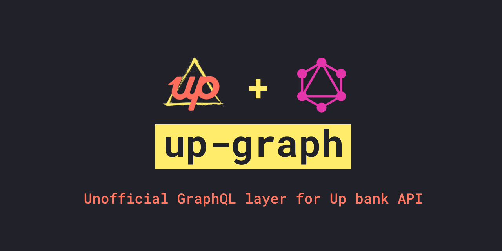

<div align="center">
  
</div>

# up-graph 😎

Unofficial GraphQL layer for [Up bank API](https://developer.up.com.au/)

**Built using:**

- [Koa node framework](https://github.com/koajs/koa)
- [GraphQL Modules](https://graphql-modules.com/)
- [TypeScript](https://www.typescriptlang.org/)

## Supported functionality

- Accounts - `list`, `get`
- Ping - `get`
- Tags - `list`, `add to transaction`, `remove from transaction`
- Transactions - `list`, `get`, `list by account`
- Webhooks - `list`, `get`, `create`, `delete`, `ping`, `list logs`

View the [GitHub project for this repo](https://github.com/aaronvanston/up-graph/projects) to track real time progress of functionality.

## Running Locally

### Starting the dev server

1. Install dependencies

```bash
yarn install
```

2. Start the server

```bash
yarn start
```

The local dev server will now start on [http://localhost:3000](http://localhost:3000)

### Playground

Access and use the GraphQL playground after starting your server at [http://localhost:3000/graphql](http://localhost:3000/graphql)

To test and verify successful connection you can query the version of the GraphQL server:

**Query:**

```graphql
query {
  version
}
```

**Response:**

```json
{
  "data": {
    "version": "local"
  }
}
```

### Authorisation

To access the UP API An `Authorization` HTTP header is required.
This GraphQL servers forwards across any supplied `Authorization` to UP.

To get your very own personal access token for UP, visit their [getting started page](https://api.up.com.au/getting_started).

For all secure operations (every query/mutation other than version).
You are required to ad the auth token. Inside of the Playground you can add an `Authorization` HTTP header under the `HTTP HEADER` tab, and add your unique token.

```json
{
  "Authorization": "Bearer up:yeah:<token>"
}
```

Once authorised, you may run a secure operation such as the ping query to test full end-to-end.

**Query:**

```graphql
query {
  ping {
    meta {
      id
      statusEmoji
    }
  }
}
```

**Response:**

```json
{
  "data": {
    "ping": {
      "meta": {
        "id": "<id>",
        "statusEmoji": "⚡️"
      }
    }
  }
}
```

### Testing and linting

#### Running test suite

Coming soon™

#### Running code linting

To run and verify tslint, you can run

```bash
yarn lint
```

### Generating Types

The schema for this GraphQL server is automatically generated by the type definitions for the queries and mutations.

These are auto-generated using [GraphQL code generator](https://graphql-code-generator.com/) at build.
You can manually trigger it by running:

```bash
yarn codegen
```

This will refresh the schema `src/modules/schema.d.ts`.

## Adding a new module

To add a new module (resource) to up-graph:

1. Create new folder within `src/modules`
1. Build out the type definitions for the resource, query and mutations by creating a `type-defs.ts` file.
1. Run `yarn codegen` to generate the schema from these types
1. Create your resolvers if required
1. Create a `index.ts` within the modules, wiring up the data source, types and resolvers
1. Add the module to `src/modules/index.ts`
